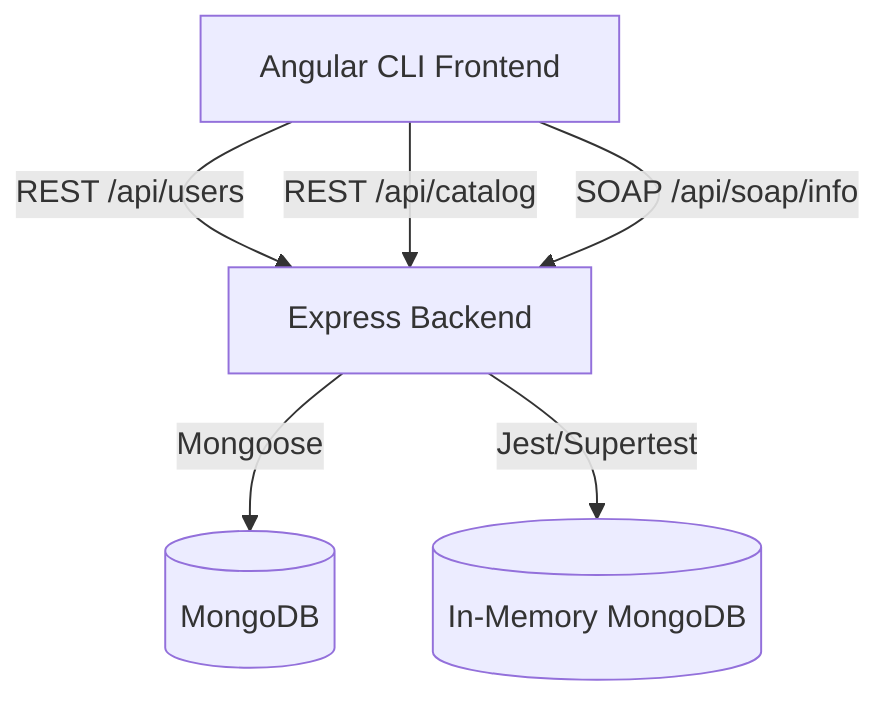

# Project: Fullstack Enterprise Web Application Blueprint

## Architecture
This project is structured as a modular fullstack web application featuring:
1. **Backend Service** (`/backend`): A Node.js and Express application connected to MongoDB using Mongoose. It exposes:
   - RESTful API endpoints for User CRUD and Catalog items.
   - A custom SOAP service endpoint for XML-based project queries.
   - Unified testing utilizing Jest and Supertest with `mongodb-memory-server` (in-memory MongoDB) to eliminate the need for an external DB daemon during test runs.
2. **Frontend client** (`/frontend`): An Angular CLI application utilizing Bootstrap grid/flexbox for layout, Less for styling with strict BEM naming, and Angular Services (`HttpClient`) for backend API interactions.
3. **Vanilla JS Showcase**: An isolated component within Angular executing raw, ES6 modular JavaScript and pure DOM tree manipulation (`document.createElement`) to demonstrate and document core concepts (hoisting, prototype inheritance, event bubbling, and propagation).

## Milestones

| # | Name | Scope | Dependencies | Status |
|---|---|---|---|---|
| 1 | **Backend API & Testing Suite** | Express setup, MongoDB connection, REST CRUD for Users, REST Catalog with seeding, SOAP service route, and automated Jest tests with in-memory DB. | None | DONE |
| 2 | **Frontend Angular Shell & Less/BEM** | Angular initialization, Bootstrap grid & Less/BEM style integration, responsive layout shell. | M1 | DONE |
| 3 | **Angular Services & Catalog Integration** | Forms binding with `[(ngModel)]`, `UserService`, `CatalogService` HTTP calls, Catalog grid with category filtering and interactive sorting. | M2 | DONE |
| 4 | **Vanilla JS Showcase & Docs** | Pure DOM manipulation component with event bubbling/hoisting/prototypes demo, and README.md creation with Mermaid diagrams. | M3 | DONE |
| 5 | **E2E Testing Track** | Independent design and implementation of 4-tier opaque-box E2E test suite, publishing `TEST_READY.md`. Runs in parallel to milestones 1-4. | None | DONE |
| 6 | **E2E Verification & Hardening** | Pass 100% of E2E tests (Tiers 1-4) and complete white-box Adversarial Coverage Hardening (Tier 5). | M4, M5 | DONE |
| 7 | **v3.0 Live Sync & Dynamic Theme** | Account User List (`UserListComponent`) with real-time RxJS Subject (`userAdded$`) updates, SPA smooth scrolling navigation (`scrollToSection`), SOAP UI removal, and dynamic Light/Dark mode switcher with copper accents and calendar indicator contrast optimization. | M6 | DONE |
| 8 | **v3.2 Inline User Editing & UI Polish** | Inline account editing inside `UserListComponent` cards with edit pen icon (`PUT /api/users/:id`), margin separation (`22px`) between sidebar forms, refresh button hover contrast, responsive icon-only layout (`<= 1399px`), and 100% unit test coverage (`ng test`). | M7 | DONE |

## Interface Contracts

### Frontend Service ↔ Backend Users API
- **Endpoint**: `POST /api/users`
  - Request: `{ email: string, date_of_birth: string (ISO Date format) }`
  - Response: `201 Created` with `{ id: number, email: string, date_of_birth: string, ... }`
  - Error: `400 Bad Request` if email is invalid or missing, or `409 Conflict` if email already exists.
- **Endpoint**: `GET /api/users/:id`
  - Response: `200 OK` with User object.
  - Error: `404 Not Found` if user doesn't exist.
- **Endpoint**: `PUT /api/users/:id`
  - Request: `{ email?: string, date_of_birth?: string }`
  - Response: `200 OK` with updated User object.
  - Error: `400 Bad Request` or `404 Not Found`.
- **Endpoint**: `DELETE /api/users/:id`
  - Response: `200 OK` or `204 No Content` indicating deletion.
  - Error: `404 Not Found` or `400 Bad Request`.

### Frontend Service ↔ Backend Catalog API
- **Endpoint**: `GET /api/catalog`
  - Response: `200 OK` with an array of at least 20 items:
    `Array<{ id: number, name: string, category: string, description: string, price: number, imageUrl: string }>`

### Frontend Service ↔ Backend SOAP API
- **Endpoint**: `POST /api/soap/info`
  - Request Headers: `Content-Type: text/xml` or `application/xml`
  - Request Body: Valid XML SOAP envelope querying project details.
  - Response Body: XML SOAP envelope with `<web:GetProjectInfoResponse>` containing application status, version, and milestone metrics.

## Code Layout

- `/backend/`
  - `config/`
    - `db.js` — MongoDB connection configuration
  - `controllers/`
    - `user.controller.js` — User CRUD endpoint logic
    - `catalog.controller.js` — Catalog query and logic
    - `soap.controller.js` — SOAP request handling
  - `models/`
    - `user.model.js` — Strict Mongoose User schema with sequential ID counter
    - `catalog.model.js` — Catalog schema
  - `routes/`
    - `user.routes.js` — Express routes for users
    - `catalog.routes.js` — Express routes for catalog
    - `soap.routes.js` — Express routes for SOAP
  - `tests/`
    - `user.test.js` — User unit tests (Supertest + Jest)
    - `catalog.test.js` — Catalog unit tests
    - `soap.test.js` — SOAP unit tests
  - `data.json` — Pre-seeded catalog items (20+ items)
  - `app.js` — Express application configurations (middleware, routes mapping)
  - `server.js` — Express server listener entry
  - `package.json` — Backend dependency manager
- `/frontend/`
  - `src/`
    - `app/`
      - `components/`
        - `navbar/` — Global navigation bar component
        - `user-form/` — User CRUD registration and profile management component
        - `catalog/` — Catalog gallery displaying 20+ items, categories filter, and sorting controls
        - `vanilla-showcase/` — Component encapsulating raw ES6 Modular JS and DOM tree manipulation
      - `services/`
        - `user.service.ts` — Angular HttpClient wrapper communicating with User APIs
        - `catalog.service.ts` — Angular HttpClient wrapper communicating with Catalog APIs
      - `app.component.*` — Entry Angular layout shell
      - `app.config.ts` — Angular environment config with `provideHttpClient()`
      - `styles.less` — Global Less stylesheet using Bootstrap and custom BEM classes
    - `main.ts` — Bootstrapping script
  - `package.json` — Frontend dependency manager
  - `angular.json` — Build configuration specifying Less as style preprocessor
