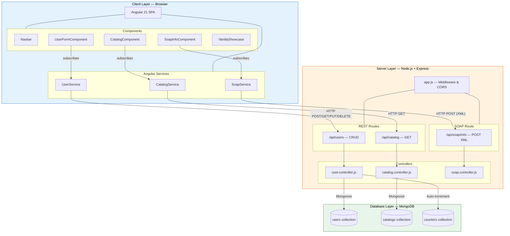
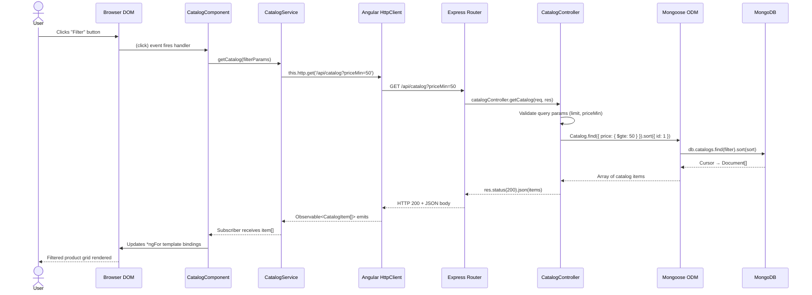

# AngularDemo — Enterprise Fullstack Training Blueprint

> A cohesive fullstack web application built with **Angular 21** frontend, **Node.js / Express** RESTful & SOAP backend, and **MongoDB**, demonstrating all mandatory training milestones from the Web Development Training Plan.

---

## Table of Contents

1. [Project Overview](#project-overview)
2. [Directory Structure](#directory-structure)
3. [System Architecture](#system-architecture)
4. [Data Flow](#data-flow)
5. [Prerequisites](#prerequisites)
6. [Setup & Running Instructions](#setup--running-instructions)
7. [Training Milestones Covered](#training-milestones-covered)
8. [API Documentation](#api-documentation)
9. [Testing Strategy](#testing-strategy)
10. [License](#license)

---

## Project Overview

**AngularDemo** is an enterprise-grade training blueprint that bridges frontend and backend development into a single, testable monorepo. It showcases:

- **RESTful CRUD** — Full Create, Read, Update, Delete cycle for Users with auto-incrementing IDs, validation, and duplicate detection.
- **Catalog API** — Seed-driven product catalog (21 items across 4 categories) with query-parameter filtering (`limit`, `priceMin`) and sorted output.
- **SOAP/XML Integration** — A standards-compliant SOAP endpoint that validates XML structure, enforces namespace rules, detects XSS payloads, and returns a SOAP Envelope response.
- **Angular 21 SPA** — Component-driven frontend with services, reactive forms, Bootstrap grid/flexbox layout, and Less/BEM styling.
- **Vanilla JS Showcase** — A standalone ES6 module demonstrating hoisting, prototype-based inheritance, pure DOM tree manipulation, and event bubbling/stopPropagation — all with mentor-oriented educational comments.
- **Comprehensive Testing** — Jest + Supertest integration tests against an in-memory MongoDB (via `mongodb-memory-server`), eliminating the need for external database daemons during CI.

---

## Directory Structure

```
D:\AngularDemo/
├── backend/
│   ├── config/
│   │   └── db.js                     # MongoDB connection & auto-seeding on empty catalog
│   ├── controllers/
│   │   ├── catalog.controller.js     # GET /api/catalog with limit & priceMin filters
│   │   ├── soap.controller.js        # POST /api/soap/info — full SOAP envelope handler
│   │   └── user.controller.js        # CRUD for /api/users with email & date validation
│   ├── models/
│   │   ├── catalog.model.js          # Mongoose schema: id, name, category, price, imageUrl
│   │   └── user.model.js             # Mongoose schema + Counter for auto-increment user IDs
│   ├── routes/
│   │   ├── catalog.routes.js         # Express router → catalogController.getCatalog
│   │   ├── soap.routes.js            # Express router → soapController.handleSoapRequest
│   │   └── user.routes.js            # Express router → CRUD (POST, GET, PUT, DELETE)
│   ├── tests/
│   │   ├── helpers/
│   │   │   └── db.helper.js          # In-memory MongoDB lifecycle: connect, clear, close
│   │   ├── catalog.test.js           # 4 tests: list all, invalid limit, limit, sort order
│   │   ├── soap.test.js              # 10+ tests: XML faults, XSS, namespace, happy path
│   │   └── user.test.js              # 10+ tests: CRUD, validation, duplicates, 404s
│   ├── app.js                        # Express app: CORS, JSON/XML parsers, route mounting
│   ├── server.js                     # Server entry: connectDB() then listen on PORT 3000
│   ├── data.json                     # 21 seed catalog items (Electronics, Clothing, Home, Books)
│   ├── jest.config.js                # Jest configuration: node env, verbose, forceExit
│   └── package.json                  # Dependencies: express, mongoose, jest, supertest, etc.
├── frontend/
│   ├── src/
│   │   ├── app/
│   │   │   ├── components/
│   │   │   │   ├── catalog/          # Product grid: category filter, sorting, price display
│   │   │   │   ├── navbar/           # Top navigation bar with route links
│   │   │   │   ├── user-form/        # User registration & profile management form
│   │   │   │   └── soap-info/        # SOAP service status display component
│   │   │   ├── services/
│   │   │   │   ├── catalog.service.ts    # HttpClient wrapper → GET /api/catalog
│   │   │   │   ├── user.service.ts       # HttpClient wrapper → CRUD /api/users
│   │   │   │   └── soap.service.ts       # HttpClient wrapper → POST /api/soap/info
│   │   │   ├── vanilla-js-showcase/
│   │   │   │   └── vanilla-showcase.js   # ES6 module: hoisting, prototypes, DOM, events
│   │   │   ├── app.component.ts          # Root component shell
│   │   │   ├── app.component.html        # Root template with router-outlet
│   │   │   ├── app.component.less        # Root styles (Less + BEM)
│   │   │   └── app.config.ts             # provideHttpClient(), provideRouter()
│   │   ├── e2e-stub/
│   │   │   └── index.html                # JSDOM E2E harness page (BEM layout, modal, sorting/filtering)
│   │   └── styles.less                   # Global styles: Bootstrap imports, BEM utilities
│   ├── angular.json                      # Angular CLI config (Less preprocessor)
│   └── package.json                      # Angular 21 dependencies
├── e2e-tests/                            # End-to-end opaque-box test suite (71 cases, 100% pass)
├── package.json                          # Root workspace: e2e scripts, shared devDependencies
└── README.md                             # ← You are here
```

---

## System Architecture



---

## Data Flow

The following sequence diagram illustrates the complete lifecycle of a catalog filter request — from user click to DOM update:



---

## Prerequisites

| Requirement | Version | Purpose |
|---|---|---|
| **Node.js** | 20+ | Runtime for both backend server and Angular CLI |
| **npm** | 10+ | Package management (ships with Node.js) |
| **MongoDB** | 7.0+ | Production database (local install or Docker) |
| **mongodb-memory-server** | 9.x | Zero-config in-memory MongoDB for test suites |
| **Angular CLI** | 21.x | Frontend scaffolding and dev server (via `npx`) |
| **Git** | 2.40+ | Version control |

> [!NOTE]
> You do **not** need a running MongoDB instance for tests. The test suites use `mongodb-memory-server` which downloads and manages a temporary MongoDB binary automatically.

---

## Setup & Running Instructions

### 1. Clone & Install

```bash
git clone <repository-url>
cd AngularDemo
```

### 2. Backend

```bash
cd backend
npm install
```

**Run Tests** (in-memory MongoDB — no external DB required):

```bash
npm test
# Runs: jest --runInBand --detectOpenHandles --forceExit
# Output: 20+ tests across catalog, user, and soap suites
```

**Start Development Server** (requires MongoDB running on `localhost:27017`):

```bash
node server.js
# ✓ Server is running on port 3000
# ✓ Auto-seeds 21 catalog items on first launch
```

**Using Docker for MongoDB:**

```bash
docker run -d --name angulardemo-mongo -p 27017:27017 mongo:7
node server.js
```

### 3. Frontend

```bash
cd frontend
npm install
```

**Start Development Server:**

```bash
npx ng serve
# ✓ Angular dev server on http://localhost:4200
# ✓ Proxies API calls to http://localhost:3000
```

**Run Unit Tests:**

```bash
npx ng test
# Karma + Jasmine test runner
```

### 4. Quick Start (Both Layers)

Open two terminal windows:

```bash
# Terminal 1 — Backend
cd backend && npm install && node server.js

# Terminal 2 — Frontend
cd frontend && npm install && npx ng serve
```

Navigate to **http://localhost:4200** in your browser.

---

## Training Milestones Covered

| # | Training Item | Where Demonstrated | Key Files |
|---|---|---|---|
| 1 | **Express.js RESTful API** | Full CRUD for Users, Read-only Catalog with query filters | `backend/controllers/user.controller.js`, `catalog.controller.js` |
| 2 | **MongoDB + Mongoose ODM** | Schema definitions, validation, pre-save hooks, auto-increment counter | `backend/models/user.model.js`, `catalog.model.js`, `config/db.js` |
| 3 | **SOAP/XML Web Service** | XML parsing, namespace validation, XSS detection, SOAP Fault/Response | `backend/controllers/soap.controller.js` |
| 4 | **Jest Unit/Integration Testing** | Supertest against Express app with in-memory MongoDB | `backend/tests/*.test.js`, `tests/helpers/db.helper.js` |
| 5 | **Angular Components & Templates** | Navbar, Catalog grid, UserForm, SoapInfo components | `frontend/src/app/components/` |
| 6 | **Angular Services & HttpClient** | Service classes wrapping HTTP calls to backend APIs | `frontend/src/app/services/*.service.ts` |
| 7 | **Angular Forms & Binding** | Two-way binding with `[(ngModel)]` for user registration | `frontend/src/app/components/user-form/` |
| 8 | **Bootstrap Grid & Flexbox** | Responsive layout using Bootstrap's 12-column grid system | `frontend/src/styles.less`, component templates |
| 9 | **Less Preprocessor & BEM** | Global and component styles using Less variables/mixins with BEM naming | `*.less` files, BEM class names in templates |
| 10 | **ES6 Modular JavaScript** | `export`/`import` syntax, arrow functions, `const`/`let`, template literals | `frontend/src/app/vanilla-js-showcase/vanilla-showcase.js` |
| 11 | **JavaScript Hoisting** | `var` vs `let`/`const` behavior, function declaration hoisting, TDZ | `vanilla-showcase.js` — `demonstrateHoisting()` |
| 12 | **Prototype-based Inheritance** | Constructor functions, `Object.create()`, prototype chain, `instanceof` | `vanilla-showcase.js` — `UIComponent` / `Modal` |
| 13 | **Pure DOM Tree Manipulation** | `document.createElement`, `appendChild`, building modal dialog tree | `vanilla-showcase.js` — `buildModalDOM()` |
| 14 | **Event Bubbling & stopPropagation** | Parent-child listeners, bubbling demonstration, propagation control | `vanilla-showcase.js` — `setupEventBubbling()` |
| 15 | **Data Seeding & Initialization** | JSON-file-driven auto-seeding on empty database with duplicate key handling | `backend/config/db.js`, `backend/data.json` |
| 16 | **Error Handling & Validation** | Input validation (email regex, date, numeric params), HTTP status codes | All controllers, Mongoose schema validators |
| 17 | **CORS Middleware** | Cross-origin resource sharing for frontend ↔ backend integration | `backend/app.js` (lines 8–16) |
| 18 | **Auto-incrementing IDs** | Counter collection with `findByIdAndUpdate` + `$inc` in pre-save hook | `backend/models/user.model.js` |

---

## API Documentation

### Health Check

| Method | Path | Description |
|---|---|---|
| `GET` | `/health` | Returns server health status |

**Response `200 OK`:**

```json
{ "status": "UP" }
```

---

### Users API — `/api/users`

#### Create User

| Method | Path | Content-Type |
|---|---|---|
| `POST` | `/api/users` | `application/json` |

**Request Body:**

```json
{
  "email": "jane.doe@example.com",
  "date_of_birth": "1995-06-15"
}
```

**Response `201 Created`:**

```json
{
  "id": 1,
  "email": "jane.doe@example.com",
  "date_of_birth": "1995-06-15T00:00:00.000Z"
}
```

**Error Responses:**

| Status | Condition | Body |
|---|---|---|
| `400` | Missing email or date_of_birth | `{ "error": "Email and date_of_birth are required" }` |
| `400` | Invalid email format | `{ "error": "Invalid email format" }` |
| `400` | Invalid or future date | `{ "error": "Invalid date_of_birth format" }` |
| `409` | Duplicate email | `{ "error": "Email already exists" }` |

---

#### Get User

| Method | Path |
|---|---|
| `GET` | `/api/users/:id` |

**Response `200 OK`:**

```json
{
  "id": 1,
  "email": "jane.doe@example.com",
  "date_of_birth": "1995-06-15T00:00:00.000Z"
}
```

**Error Responses:**

| Status | Condition | Body |
|---|---|---|
| `400` | Invalid ID (non-integer, ≤ 0) | `{ "error": "Invalid user ID" }` |
| `404` | User not found | `{ "error": "User not found" }` |

---

#### Update User

| Method | Path | Content-Type |
|---|---|---|
| `PUT` | `/api/users/:id` | `application/json` |

**Request Body** (all fields optional):

```json
{
  "email": "new.email@example.com",
  "date_of_birth": "1990-01-01"
}
```

**Response `200 OK`:**

```json
{
  "id": 1,
  "email": "new.email@example.com",
  "date_of_birth": "1990-01-01T00:00:00.000Z"
}
```

**Error Responses:**

| Status | Condition | Body |
|---|---|---|
| `400` | Invalid ID or invalid field values | `{ "error": "..." }` |
| `404` | User not found | `{ "error": "User not found" }` |
| `409` | New email already taken by another user | `{ "error": "Email already exists" }` |

---

#### Delete User

| Method | Path |
|---|---|
| `DELETE` | `/api/users/:id` |

**Response `200 OK`:**

```json
{ "message": "User deleted successfully" }
```

**Error Responses:**

| Status | Condition | Body |
|---|---|---|
| `400` | Invalid ID | `{ "error": "Invalid user ID" }` |
| `404` | User not found | `{ "error": "User not found" }` |

---

### Catalog API — `/api/catalog`

#### Get Catalog Items

| Method | Path | Query Parameters |
|---|---|---|
| `GET` | `/api/catalog` | `limit` (number, optional), `priceMin` (number, optional) |

**Response `200 OK`:**

```json
[
  {
    "id": 1,
    "name": "Wireless Headphones",
    "category": "Electronics",
    "description": "High-quality wireless headphones with noise cancellation.",
    "price": 99.99,
    "imageUrl": "https://example.com/headphones.jpg"
  },
  {
    "id": 2,
    "name": "Smart Watch",
    "category": "Electronics",
    "description": "Features fitness tracking, heart rate monitor, and notifications.",
    "price": 199.99,
    "imageUrl": "https://example.com/watch.jpg"
  }
]
```

**Query Parameter Examples:**

```
GET /api/catalog                  → All 21 items, sorted by id ASC
GET /api/catalog?limit=5          → First 5 items
GET /api/catalog?priceMin=100     → Items with price ≥ 100
GET /api/catalog?limit=3&priceMin=50 → Top 3 items priced ≥ $50
```

**Error Responses:**

| Status | Condition | Body |
|---|---|---|
| `400` | Negative or non-numeric `limit` | `{ "error": "Invalid limit parameter" }` |
| `400` | Negative or non-numeric `priceMin` | `{ "error": "Invalid priceMin parameter" }` |

---

### SOAP API — `/api/soap/info`

#### Get Project Info

| Method | Path | Content-Type |
|---|---|---|
| `POST` | `/api/soap/info` | `text/xml` or `application/xml` |

**Request Body:**

```xml
<?xml version="1.0" encoding="UTF-8"?>
<soapenv:Envelope xmlns:soapenv="http://schemas.xmlsoap.org/soap/envelope/"
                  xmlns:web="http://tempuri.org/">
  <soapenv:Body>
    <web:GetProjectInfoRequest/>
  </soapenv:Body>
</soapenv:Envelope>
```

**Response `200 OK`:**

```xml
<?xml version="1.0" encoding="UTF-8"?>
<soapenv:Envelope xmlns:soapenv="http://schemas.xmlsoap.org/soap/envelope/"
                  xmlns:web="http://tempuri.org/">
  <soapenv:Body>
    <web:GetProjectInfoResponse>
      <web:Status>Active</web:Status>
      <web:Version>1.0.0</web:Version>
      <web:Milestones>10</web:Milestones>
    </web:GetProjectInfoResponse>
  </soapenv:Body>
</soapenv:Envelope>
```

**SOAP Fault Responses** (all return HTTP `500` with XML body):

| Fault Code | Condition |
|---|---|
| `Client.MalformedXML` | Empty body or unparseable XML |
| `Client.PayloadTooLarge` | Request body exceeds 50 KB |
| `Client.SecurityFault` | XSS patterns detected (`<script>`, `onerror=`, etc.) |
| `Client.MissingEnvelope` | No SOAP `Envelope` element found |
| `Client.MissingBody` | No SOAP `Body` element found |
| `Client.EmptyBody` | SOAP `Body` element is empty |
| `Client.InvalidAction` | Missing `GetProjectInfoRequest` element |
| `Client.InvalidNamespace` | Action namespace ≠ `http://tempuri.org/` |

---

## Testing Strategy

### Backend Tests (Jest + Supertest)

```bash
cd backend
npm test
```

| Suite | Tests | Coverage |
|---|---|---|
| `catalog.test.js` | 4 tests | Full catalog list, invalid params, limit, sort order |
| `user.test.js` | 10+ tests | CRUD lifecycle, validation, duplicates, 404 handling |
| `soap.test.js` | 10+ tests | XML faults, XSS detection, namespace validation, happy path |

**Key Design Decisions:**

- **In-memory MongoDB** (`mongodb-memory-server`) — each test suite spins up an isolated MongoDB instance; no external daemon needed.
- **Per-test cleanup** — `beforeEach` clears all collections and re-seeds catalog data, ensuring complete test isolation.
- **`--runInBand`** — tests run sequentially to prevent Mongoose connection conflicts.

### Frontend Tests (Karma + Jasmine)

```bash
cd frontend
npx ng test
```

Angular component and service unit tests using the standard Angular testing utilities (`TestBed`, `HttpClientTestingModule`).

---

## License

This project is a **training exercise** and is intended for educational and internal use within the enterprise Web Development Training Plan.
