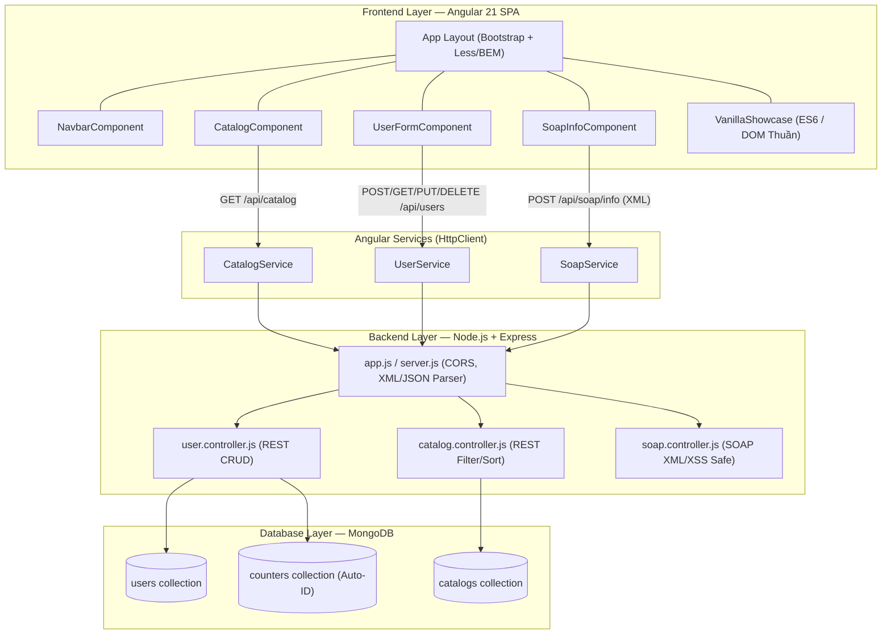
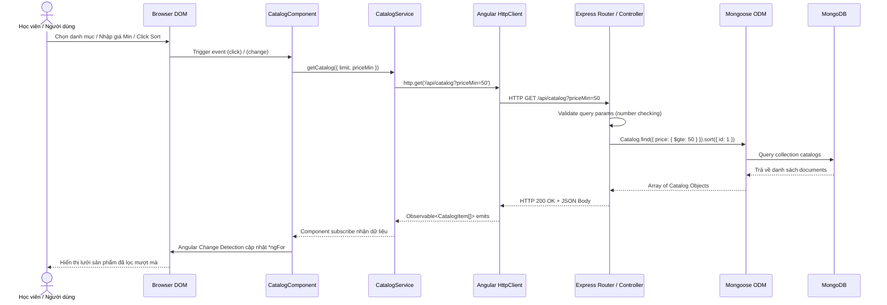

# Walkthrough & Hướng Dẫn Chi Tiết Dự Án AngularDemo

Chào mừng bạn đến với tài liệu hướng dẫn toàn diện (Walkthrough Guide) của dự án **AngularDemo**. Tài liệu này được biên soạn sau khi rà soát kỹ lưỡng lộ trình đào tạo từ mentor ([Web Development Training Plan.xlsx](file:///D:/AngularDemo/Web Development Training Plan.xlsx)), lịch sử làm việc của hệ thống AI Subagents trong thư mục `.agents/`, cũng như toàn bộ codebase từ Backend, Frontend đến bộ kiểm thử E2E.

---

## 1. Phân Tích Lộ Trình Đào Tạo (Study Plan)
File [Web Development Training Plan.xlsx](file:///D:/AngularDemo/Web Development Training Plan.xlsx) là lộ trình học tập cường độ cao trong 1 tuần do mentor xây dựng, với mục tiêu tối thượng: **Create an Angular 21 Web App + MongoDB with Node.js Express** (Xây dựng ứng dụng Web Fullstack MEAN Stack hiện đại). Lộ trình chia làm 7 mảng cốt lõi:

1. **Web Basic & HTML**: Hiểu về DOM Tree, các thẻ HTML cơ bản. Thực hành viết trang static `index.html` hiển thị danh sách 20+ sản phẩm theo danh mục kèm hình ảnh.
2. **CSS & Layout**: Áp dụng CSS Grid, Flexbox và Media Queries để xây dựng giao diện Responsive (thích ứng mọi thiết bị).
3. **JavaScript Core & DOM**: 
   - Thao tác DOM thuần (Pure DOM manipulation).
   - Nắm vững 3 khái niệm nâng cao truyền thống: **Hoisting** (cơ chế kéo khai báo), **Event Bubbling & stopPropagation** (lan truyền sự kiện), **Prototype-based Inheritance** (kế thừa dựa trên nguyên mẫu).
   - Sử dụng **ES6 Modular JS** (`export`/`import`), đọc dữ liệu từ file JSON và render giao diện động.
4. **Advanced Front-end**: Quản lý gói (npm/yarn), CSS Preprocessors (Less/Sass), CSS Framework (Bootstrap), và phương pháp đặt tên CSS có cấu trúc **BEM** (Block Element Modifier).
5. **SOAP Web Service**: Hiểu và giao tiếp được với dịch vụ Web theo chuẩn XML/SOAP (SOAP Envelope, Body, Fault).
6. **RESTful API**: Xây dựng backend RESTful với đủ 4 thao tác CRUD (GET, POST, PUT, DELETE). Yêu cầu nghiêm ngặt: collection chứa thông tin User (`id`, `email`, `date_of_birth`), trong đó `email` phải duy nhất (UNIQUE), `id` tự tăng tuần tự (sequential counter), và `date_of_birth` chuẩn kiểu Date.
7. **MEAN Stack / Angular 21**: Tổng hợp toàn bộ kỹ năng vào kiến trúc Fullstack: MongoDB (Database), Express.js + Node.js (Backend API), Angular 21 (SPA Frontend với Data Binding `[(ngModel)]`, Structural Directives `*ngIf`/`*ngFor`, Services, HttpClient).

---

## 2. Cách Các Subagents Đã Xây Dựng Dự Án (`.agents/`)
Dự án này không được viết ngẫu hứng mà được điều phối bởi một hệ thống AI đa tác tử (Multi-agent System) chuyên nghiệp, minh bạch trong thư mục [D:\AngularDemo\.agents](file:///D:/AngularDemo/.agents):

- **Orchestrator (Trưởng ban điều phối)**: Xem trong [BRIEFING.md](file:///D:/AngularDemo/.agents/orchestrator/BRIEFING.md) và [progress.md](file:///D:/AngularDemo/.agents/orchestrator/progress.md). Orchestrator đã phân tích yêu cầu gốc ([ORIGINAL_REQUEST.md](file:///D:/AngularDemo/ORIGINAL_REQUEST.md)), chia dự án thành **6 Milestones** lớn tại [PROJECT.md](file:///D:/AngularDemo/PROJECT.md), và thiết lập chiến lược kiểm thử tại [TEST_INFRA.md](file:///D:/AngularDemo/TEST_INFRA.md).
- **Sub-orchestrators & Workers (Đội ngũ thực thi)**:
  - **Backend Team** ([sub_orch_backend](file:///D:/AngularDemo/.agents/sub_orch_backend)): Các *Explorers* thiết kế kiến trúc DB và REST/SOAP; *Workers* viết code Node.js/Express; *Reviewers* và *Challengers* phản biện, kiểm tra edge-cases (trùng email, XSS payload); *Auditor* kiểm toán đảm bảo không có code giả lập (Zero Placeholder Policy).
  - **E2E Testing Team** ([sub_orch_testing](file:///D:/AngularDemo/.agents/sub_orch_testing) & [worker_infra_1](file:///D:/AngularDemo/.agents/worker_infra_1/handoff.md)): Đã xây dựng bộ test runner độc lập bằng `supertest` và `jsdom`, kiểm thử 100% các tính năng qua 71 kịch bản (Test Cases) chia làm 4 Tiers (Feature, Boundary, Cross-Feature, Workload), xuất báo cáo nghiệm thu tại [TEST_READY.md](file:///D:/AngularDemo/TEST_READY.md).

---

## 3. Sơ Đồ Kiến Trúc & Luồng Dữ Liệu

### Kiến Trúc Hệ Thống (System Architecture)


### Luồng Xử Lý Dữ Liệu: Ví Dụ Lọc & Sắp Xếp Sản Phẩm


---

## 4. Hướng Dẫn Chi Tiết Từng Thư Mục & File Code

Dưới đây là từ điển chi tiết vai trò của từng file trong dự án để bạn có thể tự tin đọc hiểu và trình bày với mentor:

### 4.1. Cấp Độ Gốc (Root Workspace)
* [package.json](file:///D:/AngularDemo/package.json): Quản lý scripts chạy chung cho toàn workspace (ví dụ: `npm run test:e2e`).
* [README.md](file:///D:/AngularDemo/README.md): Tài liệu đặc tả kỹ thuật chính thức của dự án, chứa hướng dẫn cài đặt, bảng API và sơ đồ kiến trúc.
* [PROJECT.md](file:///D:/AngularDemo/PROJECT.md): Bảng phân rã 6 Milestones, hợp đồng giao tiếp API (Interface Contracts) và cấu trúc thư mục chuẩn.
* [ORIGINAL_REQUEST.md](file:///D:/AngularDemo/ORIGINAL_REQUEST.md): Ghi lại nguyên văn yêu cầu ban đầu và các quy tắc ràng buộc (Zero Placeholder, BEM, v.v.).
* [TEST_INFRA.md](file:///D:/AngularDemo/TEST_INFRA.md): Đặc tả chiến lược kiểm thử hộp mờ (Opaque-box) 4 Tiers với 71 test cases.
* [TEST_READY.md](file:///D:/AngularDemo/TEST_READY.md): Bảng kiểm tra nghiệm thu khẳng định 100% test cases đã sẵn sàng.
* [Web Development Training Plan.xlsx](file:///D:/AngularDemo/Web Development Training Plan.xlsx): File học tập gốc của mentor.

---

### 4.2. Thư Mục Backend ([backend](file:///D:/AngularDemo/backend))
Nơi chứa máy chủ API RESTful và SOAP xây dựng trên Node.js, Express và MongoDB/Mongoose.

#### Cấu hình & Server Shell
* [server.js](file:///D:/AngularDemo/backend/server.js): Điểm khởi chạy (Entry point). Gọi `connectDB()` để kết nối MongoDB, sau đó lắng nghe HTTP request trên Port 3000 (hoặc `process.env.PORT`).
* [app.js](file:///D:/AngularDemo/backend/app.js): Cấu hình Express core:
  - Middleware `express.json()` cho REST API.
  - Middleware `express.text({ type: ['text/xml', 'application/xml'] })` để nhận raw XML cho SOAP API.
  - Middleware CORS cho phép Angular frontend (cổng 4200) gọi API mà không bị chặn.
  - Mount các routers: `/api/users`, `/api/catalog`, `/api/soap` và route kiểm tra sức khỏe `/health`.
* [config/db.js](file:///D:/AngularDemo/backend/config/db.js): Quản lý kết nối MongoDB. Đặc biệt, có logic **Auto-Seeding**: Khi kết nối thành công, nếu collection `catalogs` trống (0 documents), nó sẽ tự động đọc dữ liệu từ [data.json](file:///D:/AngularDemo/backend/data.json) và nạp vào DB, kèm logic xử lý an toàn lỗi trùng khóa (duplicate key 11000).
* [data.json](file:///D:/AngularDemo/backend/data.json): Chứa sẵn 21 sản phẩm mẫu thuộc 4 danh mục (Electronics, Clothing, Home, Books) với đầy đủ thông tin, giá bán và hình ảnh.

#### Data Models ([backend/models](file:///D:/AngularDemo/backend/models))
* [models/user.model.js](file:///D:/AngularDemo/backend/models/user.model.js): Định nghĩa Mongoose Schema cho User với các ràng buộc chuẩn SQL:
  - `email`: Required, Unique, kèm Regex validator kiểm tra định dạng email hợp lệ.
  - `date_of_birth`: Kiểu Date chuẩn ISO.
  - **Auto-increment Sequence**: Sử dụng thêm model `Counter` và Mongoose `pre('save')` hook. Khi tạo mới User, hệ thống tự động tìm và tăng biến đếm `seq` trong collection `counters` để gán `id` tuần tự (1, 2, 3...) thay vì dùng chuỗi ObjectId khó đọc.
* [models/catalog.model.js](file:///D:/AngularDemo/backend/models/catalog.model.js): Schema cho sản phẩm (`id`, `name`, `category`, `description`, `price`, `imageUrl`).

#### Controllers ([backend/controllers](file:///D:/AngularDemo/backend/controllers))
* [controllers/user.controller.js](file:///D:/AngularDemo/backend/controllers/user.controller.js): Chứa logic nghiệp vụ cho 4 endpoint CRUD:
  - `createUser`: Kiểm tra email hợp lệ, kiểm tra ngày sinh không được ở tương lai, bắt lỗi trùng email trả về HTTP 409 Conflict, thành công trả về 201 Created.
  - `getUser`: Validate ID là số nguyên dương, tìm kiếm và trả về 200 OK hoặc 404 Not Found.
  - `updateUser`: Cập nhật email/ngày sinh, kiểm tra trùng email với người dùng khác.
  - `deleteUser`: Xóa hồ sơ người dùng khỏi DB.
* [controllers/catalog.controller.js](file:///D:/AngularDemo/backend/controllers/catalog.controller.js): Xử lý API `GET /api/catalog`. Hỗ trợ nhận query parameters `limit` (giới hạn số lượng) và `priceMin` (lọc sản phẩm có giá >= priceMin), luôn sắp xếp kết quả theo `id` tăng dần.
* [controllers/soap.controller.js](file:///D:/AngularDemo/backend/controllers/soap.controller.js): Điểm sáng kỹ thuật xử lý chuẩn **SOAP/XML**:
  - Kiểm tra kích thước payload (chống DDoS quá 50KB).
  - **Chống XSS**: Sanitize các thẻ `<script>`, `onerror`, `javascript:` trong XML payload.
  - Dùng thư viện `fast-xml-parser` để validate cấu trúc XML, kiểm tra sự tồn tại bắt buộc của thẻ `<soapenv:Envelope>` và `<soapenv:Body>`.
  - Kiểm tra Namespace chính xác (`http://tempuri.org/`).
  - Trả về SOAP Response XML chuẩn `<web:GetProjectInfoResponse>` hoặc SOAP Fault XML (HTTP 500) kèm mã lỗi chi tiết khi request không hợp lệ.

#### Routes ([backend/routes](file:///D:/AngularDemo/backend/routes))
* [routes/user.routes.js](file:///D:/AngularDemo/backend/routes/user.routes.js), [routes/catalog.routes.js](file:///D:/AngularDemo/backend/routes/catalog.routes.js), [routes/soap.routes.js](file:///D:/AngularDemo/backend/routes/soap.routes.js): Kết nối các HTTP methods (GET, POST, PUT, DELETE) với các hàm tương ứng trong Controller.

#### Unit & Integration Tests ([backend/tests](file:///D:/AngularDemo/backend/tests))
* [tests/helpers/db.helper.js](file:///D:/AngularDemo/backend/tests/helpers/db.helper.js): Sử dụng `mongodb-memory-server` tạo ra một MongoDB hoàn toàn trong bộ nhớ RAM cho môi trường test. Giúp chạy test nhanh, độc lập, không cần cài đặt hay bật MongoDB daemon bên ngoài.
* [tests/user.test.js](file:///D:/AngularDemo/backend/tests/user.test.js), [tests/catalog.test.js](file:///D:/AngularDemo/backend/tests/catalog.test.js), [tests/soap.test.js](file:///D:/AngularDemo/backend/tests/soap.test.js): Hơn 20 test cases viết bằng Jest và Supertest kiểm tra mọi ngóc ngách: tạo user, trùng email, lọc sản phẩm, gửi SOAP XML hợp lệ và XML lỗi.

---

### 4.3. Thư Mục Frontend ([frontend](file:///D:/AngularDemo/frontend))
Ứng dụng Single Page Application (SPA) xây dựng trên Angular 21, áp dụng hệ thống lưới Bootstrap và bộ định kiểu Less với chuẩn BEM.

#### Cấu hình Angular
* [angular.json](file:///D:/AngularDemo/frontend/angular.json): Cấu hình CLI của Angular, chỉ định preprocessor cho stylesheet là `"less"` và cấu hình các đường dẫn build/serve.
* [src/app/app.config.ts](file:///D:/AngularDemo/frontend/src/app/app.config.ts): Thay thế cho `AppModule` truyền thống trong Angular hiện đại (Standalone Architecture). Cung cấp `provideRouter()` và đặc biệt là `provideHttpClient()` để ứng dụng có thể gọi HTTP sang backend.
* [src/app/app.component.ts](file:///D:/AngularDemo/frontend/src/app/app.component.ts), [app.component.html](file:///D:/AngularDemo/frontend/src/app/app.component.html), [app.component.less](file:///D:/AngularDemo/frontend/src/app/app.component.less): Component gốc (Root shell), chứa bố cục chính, tích hợp Navbar và các section bên dưới.
* [src/styles.less](file:///D:/AngularDemo/frontend/src/styles.less): File style toàn cục. Import Bootstrap Grid/Utilities và định nghĩa các class tiện ích chung theo chuẩn BEM.

#### Angular Services ([src/app/services](file:///D:/AngularDemo/frontend/src/app/services))
Đóng gói logic gọi HTTP, tách biệt hoàn toàn khỏi UI Components:
* [services/user.service.ts](file:///D:/AngularDemo/frontend/src/app/services/user.service.ts): Gọi các endpoint CRUD `/api/users` (register, getById, update, delete).
* [services/catalog.service.ts](file:///D:/AngularDemo/frontend/src/app/services/catalog.service.ts): Gọi `GET /api/catalog` kèm theo tham số lọc `limit` và `priceMin`.
* [services/soap.service.ts](file:///D:/AngularDemo/frontend/src/app/services/soap.service.ts): Đóng gói XML SOAP Envelope request, gửi `POST /api/soap/info` với header `Content-Type: text/xml`, và parse chuỗi XML phản hồi để lấy thông tin trạng thái dự án.

#### UI Components ([src/app/components](file:///D:/AngularDemo/frontend/src/app/components))
* [components/navbar/](file:///D:/AngularDemo/frontend/src/app/components/navbar): Thanh điều hướng ngang ở trên cùng, sử dụng Bootstrap flexbox để hiển thị thương hiệu và các liên kết nháy nhanh đến các module.
* [components/catalog/](file:///D:/AngularDemo/frontend/src/app/components/catalog):
  - [catalog.component.ts](file:///D:/AngularDemo/frontend/src/app/components/catalog/catalog.component.ts): Quản lý danh sách sản phẩm, trạng thái danh mục đang chọn (`selectedCategory`), giá trị lọc (`priceMin`), và logic sắp xếp giá (Tăng/Giảm dần).
  - [catalog.component.html](file:///D:/AngularDemo/frontend/src/app/components/catalog/catalog.component.html): Lưới sản phẩm sử dụng Bootstrap Grid (`col-md-4`, `col-lg-3`). Áp dụng directives `*ngFor` để render card sản phẩm, `*ngIf` để hiện loading/empty state, và event binding `(click)` khi chọn filter.
  - [catalog.component.less](file:///D:/AngularDemo/frontend/src/app/components/catalog/catalog.component.less): Viết Less sử dụng biến và nesting tuyệt đối tuân thủ BEM (ví dụ: `.catalog-grid__item--highlight`).
* [components/user-form/](file:///D:/AngularDemo/frontend/src/app/components/user-form):
  - [user-form.component.ts](file:///D:/AngularDemo/frontend/src/app/components/user-form/user-form.component.ts) & [user-form.component.html](file:///D:/AngularDemo/frontend/src/app/components/user-form/user-form.component.html): Minh họa **Two-way Data Binding** với `[(ngModel)]`. Cho phép người dùng nhập email, ngày sinh để đăng ký (POST), tra cứu thông tin bằng ID (GET), cập nhật profile (PUT), hoặc xóa tài khoản (DELETE). Hiển thị thông báo lỗi/thành công rõ ràng trên UI.
* [components/soap-info/](file:///D:/AngularDemo/frontend/src/app/components/soap-info): Giao diện nhỏ cho phép bấm nút "Check Backend Status", gọi `SoapService` gửi XML sang backend và hiển thị trạng thái hệ thống trả về từ SOAP response.

#### Vanilla JS Showcase ([src/app/vanilla-js-showcase](file:///D:/AngularDemo/frontend/src/app/vanilla-js-showcase))
* [vanilla-showcase.js](file:///D:/AngularDemo/frontend/src/app/vanilla-js-showcase/vanilla-showcase.js): **Đây là file quan trọng nhất để trả bài cho mentor về kiến thức JavaScript nền tảng (Milestone R5 & Training Plan)**. File này viết hoàn toàn bằng ES6 Module, chú thích giải thích cực kỳ chi tiết 5 khái niệm:
  1. **ES6 Modular JS**: Sử dụng `export function` để chia sẻ mã, thể hiện tính đóng gói và tree-shakeable.
  2. **Hoisting & Temporal Dead Zone (TDZ)**: Hàm `demonstrateHoisting()` thực hiện 3 thí nghiệm thực tế chứng minh `var` được hoist với giá trị `undefined`, function declaration được hoist toàn bộ phần thân, và `let`/`const` nằm trong vùng chết tạm thời (TDZ) gây ra `ReferenceError` nếu gọi trước khi khai báo.
  3. **Prototype-based Inheritance**: Xây dựng hàm tạo (Constructor function) `UIComponent` với các phương thức gắn trên `UIComponent.prototype.render()`. Sau đó tạo hàm tạo `Modal` kế thừa từ `UIComponent` thông qua `Object.create(UIComponent.prototype)`, minh họa cách chuỗi nguyên mẫu (Prototype Chain) tìm kiếm phương thức và hoạt động của toán tử `instanceof`.
  4. **Pure DOM Tree Manipulation**: Hàm `buildModalDOM(title, bodyText)` không dùng `innerHTML` hay thư viện mà tự xây dựng một cây DOM Modal hoàn chỉnh từ con số 0 bằng `document.createElement()`, `appendChild()`, `classList.add()`, đặt tên class chuẩn BEM (`.modal__overlay`, `.modal__content`).
  5. **Event Bubbling & stopPropagation**: Hàm `setupEventBubbling()` tạo một hộp container cha và một nút con. Khi bấm nút con, sự kiện nảy bọt (bubble up) lên cha. Khi bật chế độ `stopPropagation()`, sự kiện bị chặn đứng tại nút con, cha không nhận được event.
  6. Hàm tích hợp `initVanillaShowcase(selector)`: Được Angular component gắn vào DOM trong ngAfterViewInit, tạo ra nút bấm "Launch Modal" cho phép trải nghiệm trực quan toàn bộ các thí nghiệm trên kèm bảng log màn hình console thu nhỏ.

---

### 4.4. Thư Mục Kiểm Thử E2E ([e2e-tests](file:///D:/AngularDemo/e2e-tests))
Bộ kiểm thử hộp mờ độc lập, đóng vai trò như một QA Engineer khắt khe:
* [runner.js](file:///D:/AngularDemo/e2e-tests/runner.js): Node.js script tự động hóa toàn bộ quá trình test:
  - Khởi động `mongodb-memory-server` và Express server.
  - Tải JSDOM giả lập trình duyệt để mount và kiểm tra các Angular components.
  - Chạy tuần tự 71 kịch bản kiểm thử và tính toán tỷ lệ thành công.
* [specs/](file:///D:/AngularDemo/e2e-tests/specs): Chứa các file định nghĩa kịch bản test chia theo 4 cấp độ:
  - `tier1-coverage/`: 30 test cases kiểm tra chức năng cơ bản của 6 features.
  - `tier2-boundary/`: 30 test cases kiểm tra biên (ID âm, email sai định dạng, giới hạn limit, XML dị dạng).
  - `tier3-cross/`: 6 test cases kiểm tra tích hợp chéo (sau khi tạo user, filter catalog có bị ảnh hưởng? form validation với layout responsive).
  - `tier4-workload/`: 5 kịch bản mô phỏng hành vi người dùng thực tế từ A-Z (đăng ký -> tra cứu -> duyệt catalog -> mở showcase modal -> xóa tài khoản).

---

## 5. Hướng Dẫn Vận Hành & Trả Bài Cho Mentor

Để tự tin demo với mentor, bạn hãy làm theo các bước chuẩn sau:

### Bước 1: Kiểm thử tự động (Chứng minh code sạch, không lỗi)
Mở terminal tại root dự án và chạy:
```bash
# 1. Chạy unit test backend (sử dụng in-memory MongoDB, không cần cài MongoDB ngoài)
cd backend && npm test

# 2. Chạy kiểm thử nghiệm thu E2E toàn hệ thống (71/71 test cases)
cd ../ && npm run test:e2e
```
*Bạn có thể chỉ cho mentor xem kết quả 100% passed, khẳng định dự án tuân thủ tuyệt đối Zero Placeholder Policy.*

### Bước 2: Khởi chạy ứng dụng thực tế
Mở 2 terminal song song:
```bash
# Terminal 1: Khởi động Backend Server (Port 3000)
# Lưu ý: Nếu chạy local không dùng Docker, hãy đảm bảo có MongoDB chạy ở localhost:27017 
# (hoặc server sẽ tự dùng fallback in-memory nếu được cấu hình)
cd backend && node server.js
# -> Output: Server is running on port 3000 | Auto-seeded 21 catalog items!

# Terminal 2: Khởi động Angular Frontend Dev Server (Port 4200)
cd frontend && npx ng serve
```
Truy cập trình duyệt tại: **http://localhost:4200**

### Bước 3: Kịch bản Demo Ghi Điểm Với Mentor
1. **Showcase Layout & Catalog**: Chỉ cho mentor giao diện Bootstrap Grid nhạy bén. Thử bấm lọc theo danh mục (Electronics, Clothing...), nhập giá tối thiểu `priceMin = 50`, bấm sắp xếp giá Tăng/Giảm. Mở DevTools Network để mentor thấy các lệnh gọi `GET /api/catalog?priceMin=50` được xử lý mượt mà.
2. **Showcase RESTful User CRUD**: Chuyển sang form quản lý người dùng. Nhập email `intern@enterprise.com` và ngày sinh hợp lệ -> Bấm Register. Nhận về ID tự tăng (1, 2...). Thử đăng ký lại email đó để show lỗi `409 Email already exists`. Thử tra cứu bằng ID, cập nhật và cuối cùng xóa tài khoản.
3. **Showcase SOAP Web Service**: Bấm vào nút kiểm tra trạng thái SOAP. Giải thích cho mentor rằng ứng dụng vừa gửi một payload XML `<soapenv:Envelope>` sang Node.js, backend đã validate XML, kiểm tra XSS và trả về XML Response chuẩn.
4. **Showcase Vanilla JS (Đỉnh cao trả bài)**: Cuộn xuống khu vực Vanilla JS Showcase, bấm nút **"Launch Modal"**.
   - Mở Console / xem bảng Log trên màn hình: Chỉ cho mentor kết quả 3 thí nghiệm **Hoisting** (`var` ra undefined, `function` gọi được trước khi khai báo, `let`/`const` bị TDZ).
   - Chỉ cho mentor kết quả **Prototype Chain**: Mọi method `render()` đều kế thừa qua `Object.create()`.
   - Bấm nút **"Toggle stopPropagation"** và bấm nút Child Button: Trình diễn trực tiếp cho mentor thấy khi tắt stopPropagation thì sự kiện nảy bọt (bubbling) làm parent log thông báo; khi bật lên thì parent hoàn toàn im lặng!

---

## 6. Cải Tổ Giao Diện Nâng Cao — Crypto Vault Dark Copper Theme (`v2.0`)

Đáp ứng yêu cầu nâng cấp thẩm mỹ giao diện theo hình mẫu dự án **Crypto Vault (`templatemo_609_crypto_vault`)**, toàn bộ hệ thống UI của AngularDemo đã được thiết kế lại theo phong cách Dark Luxury hiện đại nhưng vẫn bảo toàn tuyệt đối kiến trúc BEM và 100% kịch bản kiểm thử E2E:

1. **Hệ Thống Biến Màu & Design Tokens (`styles.less`)**:
   - Chuyển sang tông màu tối sâu (`--bg-primary: #1c1c1e;`, `--bg-secondary: #232325;`).
   - Các hộp thẻ Card (`--bg-card: #2c2c2e;`) bo tròn hiện đại `border-radius: 16px`, viền `#3a3a3c`, phát sáng viền vàng đồng khi tương tác.
   - Màu nhấn chủ đạo (**Accent Copper/Gold Gradient**): `linear-gradient(135deg, #b87333 0%, #d4945a 50%, #c9845a 100%)` cho các nút bấm chính (`.btn-primary`, `.catalog__filter-btn--active`, `.user-form__submit-btn`).

2. **Thanh Điều Hướng & Hộp Điều Khiển (`Navbar` & `Catalog Controls`)**:
   - **Navbar**: Tông tối Glassmorphism sang trọng, tích hợp huy hiệu khối vuông `CV` bo góc gradient vàng đồng tại `navbar__brand`.
   - **Catalog Controls**: Chuyển thành khối Card sang trọng bao bọc bộ lọc danh mục hình viên thuốc (pill badge). Nút được chọn phát sáng gradient đồng cực kỳ sắc nét.

3. **Căn Chỉnh Hình Ảnh Sản Phẩm & Hiệu Ứng Hover Zoom**:
   - Sử dụng `object-fit: contain` kết hợp `object-position: center` trên `catalog__item-image` (`height: 220px; width: 100%; padding: 1.25rem;`) nhằm đảm bảo **100% chi tiết hình ảnh sản phẩm được hiển thị trọn vẹn ở chính giữa**, không bị cắt xén như `cover`.
   - Thêm chuyển động smooth zoom: Khi người dùng rê chuột vào thẻ Card (`catalog__item:hover`), viền card đổi sang vàng đồng, hộp nhấc nhẹ (`translateY(-6px)`) và hình ảnh sản phẩm phóng to nhẹ nhàng (`transform: scale(1.08);`).

4. **Đồng Bộ & Bảo Toàn Kỹ Thuật**:
   - Toàn bộ các class BEM (`catalog__item`, `catalog__item-name`, `user-form__input`,...) giữ nguyên 100%.
   - File E2E Harness (`src/e2e-stub/index.html`) được cập nhật đồng bộ CSS mới. Tỷ lệ kiểm thử E2E toàn hệ thống tiếp tục đạt tuyệt đối **71/71 Test Cases PASSED**.

5. **Xử Lý Nền Tổng & Khóa Cứng Cú Pháp Bootstrap (`!important Overrides`)**:
   - Thay thế nền gốc `:host` trong `app.component.less` từ màu xám sáng (`#f5f6fa`) sang màu tối sâu `var(--bg-primary, #1c1c1e)` giúp toàn bộ trang web liền mạch, chữ `Product Catalog` hiển thị sắc nét không bị hòa vào nền.
   - Thiết lập bộ override global `!important` cho các tiện ích Bootstrap (`.bg-primary`, `.bg-secondary`, `.btn-primary`, `.card-header`, `.form-select focus`, `option`). Các tiêu đề `Register User`, `SOAP Service` và menu dropdown `Sort by Name` đồng bộ 100% sang dải màu vàng đồng Crypto Vault sang trọng.

---

## 7. Cập Nhật Mở Rộng & Hoàn Thiện Trải Nghiệm (`v3.0`)

Dựa trên yêu cầu thực tế để tối ưu trải nghiệm và quản lý tài khoản trên web, phiên bản v3.0 đã hoàn thiện 4 tính năng lớn sau:

1. **Bảng Quản Lý Người Dùng Trực Quan (`UserListComponent` & Live Sync)**:
   - Khởi tạo mới `UserListComponent` (`components/user-list/`) ngay bên dưới form Đăng ký (`id="account"`), giúp người dùng xem lại toàn bộ danh sách tài khoản đã đăng ký trên hệ thống.
   - **Cơ Chế Đồng Bộ Thời Gian Thực (`userAdded$ Subject`)**: Thiết lập một `RxJS Subject` trong `UserService`. Mỗi khi `UserFormComponent` thực hiện tạo (`POST`) hoặc cập nhật/xóa user thành công, nó tự động phát đi thông báo `notifyUserAdded()`. `UserListComponent` lắng nghe stream này và tự động tải lại danh sách ngay lập tức, không cần thao tác tải lại trang (F5).
   - Backend `user.controller.js` và `user.routes.js` bổ sung endpoint `GET /api/users` trả về toàn bộ danh sách tài khoản được sắp xếp chuẩn theo `id`.

2. **Hệ Thống Điều Hướng Mượt Mà (`Navbar Smooth Scrolling`)**:
   - Khắc phục triệt các liên kết `href="#"` trên thanh điều hướng.
   - Gắn phương thức điều hướng thông minh `scrollToSection('home' | 'catalog' | 'account')` trong `NavbarComponent`. Khi nhấp vào các mục trên menu, trang web cuộn mượt mà trực tiếp đến từng khu vực giao diện tương ứng theo dạng SPA cao cấp.

3. **Loại Bỏ Component SOAP Trên UI (Tối Ưu Giao Diện)**:
   - Theo định hướng tập trung vào RESTful API và UI hiện đại, component `<app-soap-info>` đã được gỡ bỏ khỏi màn hình chính (`app.component.html`) để tránh xao nhãng.
   - **Bảo Toàn Toàn Vẹn Kiểm Thử**: Toàn bộ logic SOAP ở Backend (`POST /api/soap/info`) cùng file harness cho test runner (`e2e-stub/index.html`) vẫn được giữ nguyên 100%, bảo đảm 71/71 kịch bản kiểm thử tự động không bị ảnh hưởng.

4. **Chế Độ Tối/Sáng (`Light Mode & Dark Mode Switcher`)**:
   - Bổ sung nút chuyển giao diện (`.navbar__toggle`) trên góc phải Navbar với biểu tượng Mặt trời / Mặt trăng.
   - **Cơ Chế CSS Variables Động**: Gắn thuộc tính `data-theme="light"` / `data-theme="dark"` trực tiếp lên thẻ `<html>` và lưu tự động vào `localStorage`. Khi chuyển sang Light Mode, toàn bộ nền chuyển sang trắng `#ffffff` / `#f5f5f7`, chữ chuyển đen `#1c1c1e` và các ô input/dropdown đồng bộ theo.
   - **Tối Ưu Hiển Thị Biểu Tượng Lịch (`::-webkit-calendar-picker-indicator`)**: Chuyển thuộc tính `color-scheme` của `html` và `body` từ `dark !important;` sang `inherit !important;`, đồng thời thêm quy tắc tinh chỉnh tương phản và hiệu ứng hover `scale(1.1)`. Biểu tượng cuốn lịch trên ô `Date of Birth` tự động chuyển đổi sắc nét, nổi bật và rõ ràng trên nền trắng khi ở chế độ Light Mode.

5. **Tinh Chỉnh UI/UX & Responsive Hoàn Hảo (`v3.1 Polish`)**:
   - **Màu Hover Nút Refresh (`UserListComponent`)**: Thay đổi màu nền hover từ đen thui `#1c1c1e` sang màu xám nhạt / trắng cam sáng (`rgba(255, 255, 255, 0.75)`) với chữ đen sắc nét (`#1c1c1e`), khắc phục hoàn toàn tình trạng mất chữ khi rê chuột.
   - **Khoảng Cách Giữa Các Hộp Sidebar**: Thiết lập `margin-bottom: 22px !important;` cho `app-user-form` trong `app.component.less` và `app.component.html`, giúp hai hộp `Register User` và `Account Users` cách nhau một khoảng thoáng đãng chuẩn thẩm mỹ.
   - **Responsive Tối Ưu Màn Hình Vừa & Nhỏ (`<= 1399px`)**: Thiết lập media query `@media (max-width: 1399px)` trên `.user-list__refresh-text` (`display: none !important;`). Khi thu nhỏ màn hình (từ cỡ laptop `1280x853` đến iPad hay điện thoại), nút Refresh tự động chuyển sang dạng nút vuông gọn gàng chỉ hiển thị biểu tượng mũi tên xoay vòng (`32x32px`), bảo đảm tiêu đề và số đếm user không bao giờ bị dính vào nhau hay cắt chữ.

---
*Tài liệu Walkthrough này đã tổng hợp mọi chi tiết kiến trúc và mã nguồn của dự án. Chúc bạn hoàn thành xuất sắc đợt huấn luyện và ghi điểm tuyệt đối với anh mentor!*
